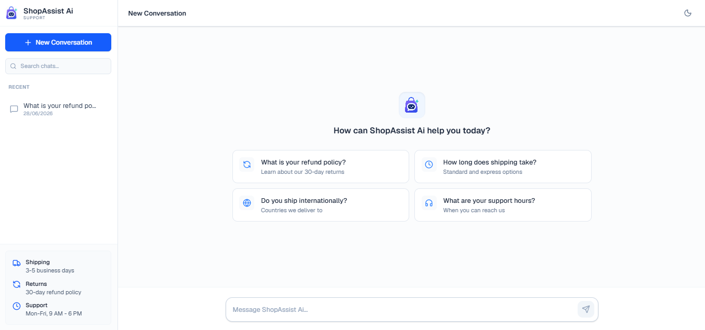
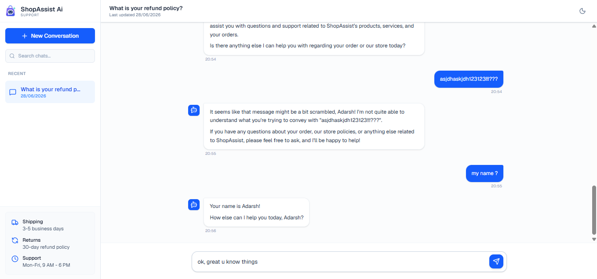
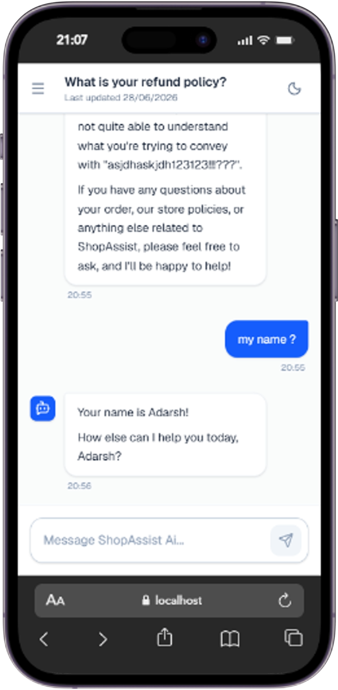
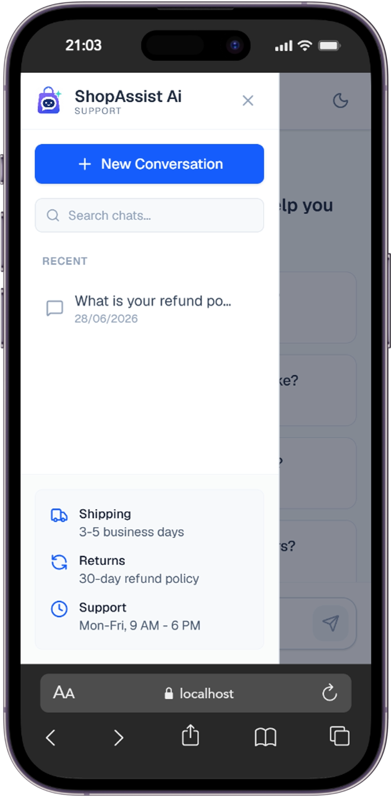
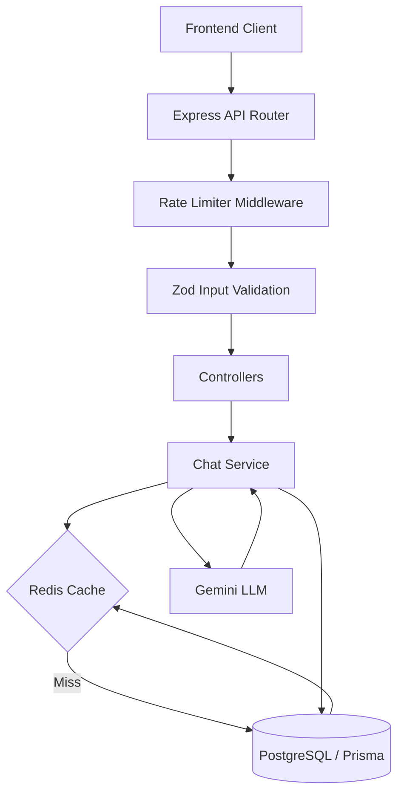

# ShopAssist AI

ShopAssist Ai is an AI-powered customer support platform, equipped with context-aware AI conversations, session management, robust PostgreSQL persistence, and distributed Redis caching and rate limiting.


## Features

- **AI Customer Support:** Powered by Google's Gemini 2.5 Flash, strictly prompted to act as the ShopAssist Ai Customer Support Agent.
- **Conversation Persistence:** All chats are durably saved to a Supabase PostgreSQL database via Prisma.
- **Session Restoration:** Users can seamlessly return to past conversations and pick up exactly where they left off.
- **Context-Aware Responses:** Previous conversation history is provided to the LLM, enabling coherent multi-turn conversations.
- **Redis Conversation Cache:** Reduces repeated PostgreSQL queries by caching conversation history.
- **Distributed Rate Limiting:** Protects the AI endpoint from abuse (30 requests per 15 minutes) using Redis, with an automatic in-memory fallback.
- **Responsive UI:** A mobile-friendly interface with Dark Mode support built with Tailwind CSS.
- **Graceful Error Handling:** System gracefully degrades to PostgreSQL if Redis fails, and surfaces clean JSON errors to the frontend.
- **Modular Backend Architecture:** Clean separation of concerns, Zod input validation, and secure CORS configurations.

---

## Tech Stack

| Layer | Technologies |
| --- | --- |
| **Frontend** | Next.js, TypeScript, TailwindCSS, Zustand, TanStack React Query, Axios, Lucide React |
| **Backend** | Node.js, Express, TypeScript, Prisma ORM, Zod Validation |
| **Database** | PostgreSQL (Supabase) |
| **Caching & Rate Limiting** | Upstash Redis |
| **AI Integration** | Google Gemini SDK (`@google/genai`) |
| **Deployment** | Vercel (Frontend), Render (Backend) |

---

## Screenshots

### Desktop View

| Home Screen | Conversation |
| :---: | :---: |
|  |  |

### Mobile View

| Conversation  | Sidebar Layout   |
| :---: | :---: |
|  |  |


---

## Project Structure

```text
.
├── backend/              # Express Node.js Application
│   ├── cache/            # Redis cache service wrappers
│   ├── config/           # Initialization for Prisma and Redis clients
│   ├── controller/       # HTTP route handlers
│   ├── middleware/       # Rate limiting, Zod validation, Error handling
│   ├── prisma/           # Database schema and migrations
│   ├── routes/           # Express router definitions
│   └── services/         # Core business logic of Chat, LLM integrations
│
└── frontend/             # Next.js React application
    ├── src/app/          # App Router pages and global layouts
    ├── src/components/   # Reusable UI components (Chat, Sidebar, etc.)
    ├── src/services/     # API clients (Axios/TanStack Query)
    └── src/store/        # Zustand global state management
```

---

## Architecture Overview

The backend strictly adheres to a layered architecture to guarantee a clean separation of concerns.



### Data Flow Lifecycle

1. **User sends message** → Frontend fires mutation.
2. **Backend receives request** → Payload is parsed and validated by Zod.
3. **Rate Limiter** → Checks IP against Redis bucket. Passes if under limit.
4. **Conversation Lookup** → `chat.service.ts` attempts to fetch chat history.
5. **Redis Cache** → If history exists in Upstash, return immediately.
6. **PostgreSQL Fallback** → If cache miss, fetch from PostgreSQL and populate Redis cache.
7. **Gemini LLM** → Generates context-aware response based on history + new message.
8. **Persistence** → New user message and AI reply are committed to PostgreSQL.
9. **Cache Invalidation** → Old Redis cache is wiped to ensure the next fetch is fresh.
10. **Return Response** → Clean JSON payload sent back to the frontend UI.

---

## Database Design

The PostgreSQL database is managed via Prisma and utilizes a simple, highly-relational schema:

* **`Conversation` Model:** Represents a unique chat session. Holds a unique `id` and a `createdAt` timestamp. Serves as the parent container for all messages inside a specific session.
* **`Message` Model:** Represents individual chat bubbles. Stores the `sender` (user or AI), the actual `text` content, and a `conversationId` foreign key linking it back to its parent conversation.

---

## Redis Integration

Upstash Redis was integrated to drastically reduce latency and protect the database from excessive queries.

* **Why Redis?** Fetching conversation history is the most frequent operation in a chat application. Caching it in Redis significantly reduces repeated database queries and improves response latency.
* **What is Cached:** The entire array of past messages for a specific `conversationId`.
* **TTL (Time to Live):** Cached histories expire after 10 minutes (`REDIS_HISTORY_TTL=600`) to keep memory usage efficient.
* **Invalidation:** The moment a new message is sent, the cache for that conversation is immediately destroyed.
* **Graceful Fallback:** If the Upstash Redis instance goes down, network calls are wrapped in `try/catch` blocks. The system silently degrades to querying PostgreSQL directly—meaning users never experience an outage.

---

## Rate Limiting

To prevent API abuse and control LLM costs, the `POST /chat/message` endpoint is protected by distributed rate limiting..

* **Limit:** 30 requests per 15 minutes per IP.
* **Implementation:** Utilizes Redis `INCR` and `EXPIRE` counters.
* **Memory Fallback:** If Redis is completely unavailable, the rate limiter falls back to an internal Node.js `Map` that self-cleans expired entries every 15 minutes to prevent memory leaks.
* **Response:** Exceeding the limit results in a clean `429 Too Many Requests` HTTP response, complete with a `Retry-After: 900` header.

---

## API Documentation

### `GET /health`
Checks the operational status of the API, Database, and Redis.
* **Response:**
  ```json
  {
    "success": true,
    "database": "connected",
    "redis": "enabled"
  }
  ```

### `POST /chat/message`
Sends a user message to the AI and returns the response.
* **Request Body:**
  ```json
  {
    "message": "What is your refund policy?",
    "sessionId": "optional-session-id" 
  }
  ```
* **Success Response (200):**
  ```json
  {
    "reply": "We offer a 30-day refund policy.",
    "sessionId": "cuid-conversation-id"
  }
  ```
* **Error Response (429 Too Many Requests):**
  ```json
  {
    "success": false,
    "message": "Rate limit exceeded. Please try again in a few minutes."
  }
  ```

### `GET /chat/history/:sessionId`
Fetches the complete message history for a given conversation.
* **Response (200):**
  ```json
  {
    "messages": [
      {
        "id": "cuid",
        "sender": "user",
        "text": "Hello",
        "createdAt": "2026-06-25T12:00:00.000Z"
      }
    ]
  }
  ```

---

## Security & Error Handling

* **Input Validation:** Zod enforces strict schemas on all incoming HTTP requests to prevent malformed data.
* **Rate Limiting:** Protects the expensive Gemini LLM endpoints from malicious loops.
* **CORS:** API is configured to accept requests from the designated `FRONTEND_URL` (or allows all origins as a fallback during local development if omitted).
* **Centralized Errors:** A global error middleware catches all uncaught exceptions, ensuring the backend never crashes and always returns a sanitized JSON response.
* **No Secrets Committed:** All API keys are loaded strictly via `.env`.

---
## Design Decisions

* **Next.js (App Router):** Chosen for optimal React server-side rendering, routing capabilities, and overall ecosystem maturity.
* **Prisma + PostgreSQL:** Prisma provides strong Type-Safety and a structured developer experience when mutating SQL databases.
* **Upstash Redis:** Serverless, HTTP-based Redis that fits the cloud-native, low-maintenance deployment model of this project.
* **Gemini 2.5 Flash:** Offers an optimal balance of speed and reasoning capabilities, suitable for low-latency chat environments.
* **Zustand + TanStack Query:** Zustand handles lightweight global UI state (like Dark Mode and Sidebar toggles), while TanStack Query manages complex asynchronous server state and caching for the chat interface.

---

## LLM Notes

**Provider Used:** Google Gemini (`gemini-2.5-flash`) via the `@google/genai` SDK. Gemini was selected for its low latency, straightforward integration, and generous free tier, making it well suited for this assignment.

### Prompting Strategy

- Store policies and customer support instructions are provided through the model's native `systemInstruction`.
- The complete conversation history for the active session is formatted and passed into `chats.create({ history })` to maintain multi-turn conversational context.
- Responses are limited to **512 output tokens**, preventing excessively long responses while keeping latency and token usage predictable.
- The model is instructed to remain focused on customer support queries and politely direct unsupported requests to `support@shopassist.com`.

### Error Handling

- **400** – Invalid request or input validation failure.
- **429** – Rate limit exceeded.
- **502–504** – Upstream AI service failures are handled gracefully and surfaced with appropriate HTTP status codes.
- **500** – Unexpected server errors are caught by the global error middleware.

---

## Trade-offs & "If I had more time..."

To remain focused on the core assignment constraints, the following conscious trade-offs were made, and if I had more time I would have implemented these:
* **Authentication:** The application relies on local storage session tracking rather than full JWT/OAuth auth, as it wasn't strictly required.
* **No Streaming Responses:** AI responses are currently buffered and sent as a single payload. Implementing SSE (Server-Sent Events) for streaming would improve UX but increase backend complexity.
* **Single Tenant:** The system is designed for a single store's knowledge base.
* **Response Streaming:** Using Server-Sent Events to stream chunks of text back to the UI for a GPT-like feel.
* **Multi-LLM Support:** Implement an abstract Factory pattern to allow dynamically swapping between Gemini, Claude, and OpenAI via environment variables.
* **Deployment:** Use of Docker to containerize the application for easier and more reliable deployment.
* **Automated Testing:** Add comprehensive unit, integration, and end-to-end tests (using Vitest/Jest and Playwright) to improve reliability and catch regressions.


---

## Requirement  Checklist

- [x] Chat UI matching modern standards
- [x] LLM Integration (Gemini (selected for its speed and straightforward integration))
- [x] Context-aware conversation history
- [x] Conversation persistence (PostgreSQL)
- [x] Session restoration (Sidebar history)
- [x] Input validation (Zod)
- [x] Robust error handling (Middleware)
- [x] Production Deployment (Render + Vercel)
- [x] **Bonus:** Distributed Redis Caching
- [x] **Bonus:** Distributed Rate Limiting
- [x] **Bonus:** Graceful Database Degradation
- [x] **Bonus:** Dark Mode Support

---

## Author

**Adarsh Verma**  
Portfolio: [https://adarshverma.xyz](https://adarshverma.xyz)  
Email: [vermaadarsh1024@gmail.com](mailto:vermaadarsh1024@gmail.com)
