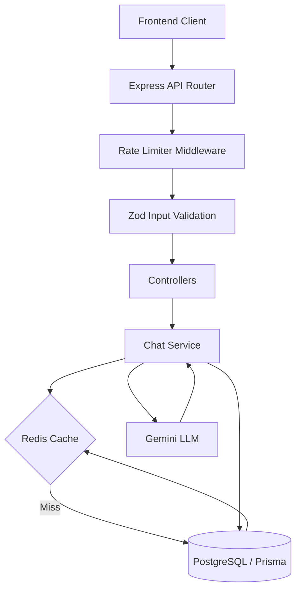

# ShopAssist Ai

An AI-powered customer support chat application built for the **Spur Founding Full Stack Engineer** assignment. 

ShopAssist Ai simulates a real customer support platform, equipped with context-aware AI conversations, session management, robust PostgreSQL persistence, and distributed Redis caching and rate limiting.

<div align="center">


</div>

<!-- Insert Hero Image Here -->
> **

## Live Demo
* **Frontend:** [https://spur-ai-chat-agent-rl09.onrender.com](https://spur-ai-chat-agent-rl09.onrender.com) *(Update with real frontend URL if different)*
* **Backend API:** [https://spur-ai-chat-agent-rl09.onrender.com](https://spur-ai-chat-agent-rl09.onrender.com)
* **Health Endpoint:** [https://spur-ai-chat-agent-rl09.onrender.com/health](https://spur-ai-chat-agent-rl09.onrender.com/health)

> **Note:** The backend is deployed on Render's free tier. If the API hasn't been used in a while, it may take 30–50 seconds to spin up on the first request (cold start).

---

## Features

- **AI Customer Support:** Powered by Google's Gemini 2.5 Flash, strictly prompted to act as the ShopAssist Ai Customer Support Agent.
- **Conversation Persistence:** All chats are durably saved to a Supabase PostgreSQL database via Prisma.
- **Session Restoration:** Users can seamlessly return to past conversations and pick up exactly where they left off.
- **Context-Aware Responses:** The LLM is fed previous chat history to provide highly accurate, contextual answers.
- **Redis Conversation Cache:** Drastically reduces database reads by caching heavily accessed chat histories.
- **Distributed Rate Limiting:** Protects the AI endpoint from abuse (30 requests per 15 minutes) using Redis, with an automatic in-memory fallback.
- **Responsive UI:** A stunning, mobile-friendly interface with Dark Mode support built with Tailwind CSS v4.
- **Graceful Error Handling:** System gracefully degrades to PostgreSQL if Redis fails, and surfaces clean JSON errors to the frontend.
- **Production-Ready Architecture:** Clean separation of concerns, Zod input validation, and secure CORS configurations.

---

## Tech Stack

| Layer | Technologies |
| --- | --- |
| **Frontend** | Next.js 16 (App Router), TypeScript, TailwindCSS v4, Zustand, TanStack React Query, Axios, Lucide React |
| **Backend** | Node.js, Express, TypeScript, Prisma ORM, Zod Validation |
| **Database** | PostgreSQL (Supabase) |
| **Caching & Rate Limiting** | Upstash Redis |
| **AI Integration** | Google Gemini SDK (`@google/genai`) |
| **Deployment** | Vercel (Frontend), Render (Backend) |

---

## Screenshots

### Desktop View

*The clean, expansive desktop layout featuring a persistent sidebar and immediate chat interaction.*

### Mobile View

*A highly responsive mobile layout with a slide-out drawer for seamless navigation.*

### Chat Interface

*Real-time conversational UI with markdown support and intelligent AI responses.*

### Session History

*Easily switch between previous conversation sessions, instantly loaded from the Redis cache.*

---

## Project Structure

This is a monorepo containing both the frontend client and the backend API.

```text
spur/
├── frontend/             # Next.js React application
│   ├── src/app/          # App Router pages and global layouts
│   ├── src/components/   # Reusable UI components (Chat, Sidebar, etc.)
│   ├── src/store/        # Zustand global state management
│   └── src/services/     # API clients (Axios/TanStack Query)
│
└── backend/              # Express Node.js API
    ├── prisma/           # Database schema and migrations
    ├── cache/            # Redis cache service wrappers
    ├── config/           # Initialization for Prisma and Redis clients
    ├── controller/       # Thin HTTP route handlers
    ├── middleware/       # Rate limiting, Zod validation, Error handling
    ├── routes/           # Express router definitions
    └── services/         # Core business logic (Chat, LLM integrations)
```

---

## Architecture Overview

The backend strictly adheres to a layered architecture to guarantee a clean separation of concerns.



### Data Flow Lifecycle

1. **User sends message** → Frontend fires mutation.
2. **Backend receives request** → Payload is parsed and validated by Zod.
3. **Rate Limiter** → Checks IP against Redis bucket. Passes if under limit.
4. **Conversation Lookup** → `chat.service.ts` attempts to fetch chat history.
5. **Redis Cache** → If history exists in Upstash, return immediately.
6. **PostgreSQL Fallback** → If cache miss, fetch from PostgreSQL and populate Redis cache.
7. **Gemini LLM** → Generates context-aware response based on history + new message.
8. **Persistence** → New user message and AI reply are committed to PostgreSQL.
9. **Cache Invalidation** → Old Redis cache is wiped to ensure the next fetch is fresh.
10. **Return Response** → Clean JSON payload sent back to the frontend UI.

---

## Database Design

The PostgreSQL database is managed via Prisma and utilizes a simple, highly-relational schema:

* **`Conversation` Model:** Represents a unique chat session. Holds a unique `id` and a `createdAt` timestamp. Serves as the parent container for all messages inside a specific session.
* **`Message` Model:** Represents individual chat bubbles. Stores the `sender` (user or AI), the actual `text` content, and a `conversationId` foreign key linking it back to its parent conversation.

---

## Redis Integration

Upstash Redis was integrated to drastically reduce latency and protect the database from excessive queries.

* **Why Redis?** Fetching conversation history is the most frequent operation in a chat app. Caching this in memory provides immense speed improvements.
* **What is Cached:** The entire array of past messages for a specific `conversationId`.
* **TTL (Time to Live):** Cached histories expire after 10 minutes (`REDIS_HISTORY_TTL=600`) to keep memory usage efficient.
* **Invalidation:** The moment a new message is sent, the cache for that conversation is immediately destroyed.
* **Graceful Fallback:** If the Upstash Redis instance goes down, network calls are wrapped in `try/catch` blocks. The system silently degrades to querying PostgreSQL directly—meaning users never experience an outage.

---

## Rate Limiting

To prevent API abuse and control LLM costs, the `POST /chat/message` endpoint is heavily protected.

* **Limit:** 30 requests per 15 minutes per IP.
* **Implementation:** Utilizes Redis `INCR` and `EXPIRE` counters.
* **Memory Fallback:** If Redis is completely unavailable, the rate limiter falls back to an internal Node.js `Map` that self-cleans expired entries every 15 minutes to prevent memory leaks.
* **Response:** Exceeding the limit results in a clean `429 Too Many Requests` HTTP response, complete with a `Retry-After: 900` header.

---

## API Documentation

### `GET /health`
Checks the operational status of the API, Database, and Redis.
* **Response:**
  ```json
  {
    "success": true,
    "database": "connected",
    "redis": "enabled"
  }
  ```

### `POST /chat/message`
Sends a user message to the AI and returns the response.
* **Request Body:**
  ```json
  {
    "message": "What is your refund policy?",
    "sessionId": "optional-session-id" 
  }
  ```
* **Success Response (200):**
  ```json
  {
    "reply": "We offer a 30-day refund policy.",
    "sessionId": "cuid-conversation-id"
  }
  ```
* **Error Response (429 Too Many Requests):**
  ```json
  {
    "success": false,
    "message": "Rate limit exceeded. Please try again in a few minutes."
  }
  ```

### `GET /chat/history/:sessionId`
Fetches the complete message history for a given conversation.
* **Response (200):**
  ```json
  {
    "messages": [
      {
        "id": "cuid",
        "sender": "user",
        "text": "Hello",
        "createdAt": "2026-06-25T12:00:00.000Z"
      }
    ]
  }
  ```

---

## Security & Error Handling

* **Input Validation:** Zod enforces strict schemas on all incoming HTTP requests to prevent malformed data.
* **Rate Limiting:** Protects the expensive Gemini LLM endpoints from malicious loops.
* **CORS:** API is strictly configured to only accept requests from the designated `FRONTEND_URL`.
* **Centralized Errors:** A global error middleware catches all uncaught exceptions, ensuring the backend never crashes and always returns a sanitized JSON response.
* **No Secrets Committed:** All API keys are loaded strictly via `.env`.

---

## Local Development

### 1. Clone & Install
```bash
git clone <repo-url>
cd spur-ai-chat-agent

# Install backend dependencies
cd backend
bun install

# Install frontend dependencies
cd ../frontend
bun install
```

### 2. Environment Variables

**Backend (`backend/.env`):**
| Variable | Description |
| --- | --- |
| `PORT` | The port the Express server will run on (e.g., 8000) |
| `DATABASE_URL` | Your Supabase PostgreSQL connection string |
| `DIRECT_URL` | The direct connection string for Prisma migrations |
| `GEMINI_API_KEY` | Your Google Gemini API Key |
| `REDIS_URL` | *(Optional)* Upstash Redis URL |
| `REDIS_TOKEN` | *(Optional)* Upstash Redis Token |
| `FRONTEND_URL` | Allowed CORS origin (e.g., `http://localhost:3000`) |

**Frontend (`frontend/.env.local`):**
| Variable | Description |
| --- | --- |
| `NEXT_PUBLIC_API_URL` | URL to your backend (e.g., `http://localhost:8000`) |

### 3. Database Migration
Navigate to the backend and push the schema to your PostgreSQL instance:
```bash
cd backend
bunx prisma migrate dev
```

### 4. Run the Stack
Start both servers in separate terminal windows:
```bash
# Terminal 1 (Backend)
cd backend
bun run dev

# Terminal 2 (Frontend)
cd frontend
bun run dev
```

---

## Design Decisions

* **Next.js (App Router):** Chosen for optimal React server-side rendering, routing capabilities, and overall ecosystem maturity.
* **Prisma + PostgreSQL:** Prisma provides unbeatable Type-Safety and developer experience when mutating SQL databases.
* **Upstash Redis:** Serverless, HTTP-based Redis that perfectly fits the cloud-native, low-maintenance deployment model of this project.
* **Gemini 2.5 Flash:** Offers an incredible balance of speed and reasoning capabilities, perfect for low-latency chat environments.
* **Zustand + TanStack Query:** Zustand handles lightweight global UI state (like Dark Mode and Sidebar toggles), while TanStack Query manages complex asynchronous server state and caching for the chat interface.

---

## Trade-offs

To remain focused on the core assignment constraints, the following conscious trade-offs were made:
* **Authentication Omitted:** The application relies on local storage session tracking rather than full JWT/OAuth auth, as it wasn't strictly required.
* **No Streaming Responses:** AI responses are currently buffered and sent as a single payload. Implementing SSE (Server-Sent Events) for streaming would improve UX but increase backend complexity.
* **Single Tenant:** The system is designed for a single store's knowledge base.

---

## Future Improvements

If given an additional week, I would implement:
1. **Response Streaming:** Using Server-Sent Events to stream chunks of text back to the UI for a ChatGPT-like feel.
2. **Multi-LLM Support:** Implement an abstract Factory pattern to allow dynamically swapping between Gemini, Claude, and OpenAI via environment variables.
3. **Authentication:** Add NextAuth for persistent user accounts across devices.
4. **Admin Dashboard:** A separate route to view chat logs, adjust the AI's system prompt, and monitor rate limiting metrics.

---

## Assignment Checklist

- [x] Chat UI matching modern standards
- [x] LLM Integration (Gemini)
- [x] Context-aware conversation history
- [x] Conversation persistence (PostgreSQL)
- [x] Session restoration (Sidebar history)
- [x] Input validation (Zod)
- [x] Robust error handling (Middleware)
- [x] Production Deployment (Render + Vercel)
- [x] **Bonus:** Distributed Redis Caching
- [x] **Bonus:** Distributed Rate Limiting
- [x] **Bonus:** Graceful Database Degradation

---

## Author

**Adarsh Verma**
* GitHub: [github.com/exorcist09](https://github.com/exorcist09)
* LinkedIn: [linkedin.com/in/adarsh-verma](#) *(Update Link)*
* Portfolio: [your-portfolio.com](#) *(Update Link)*
